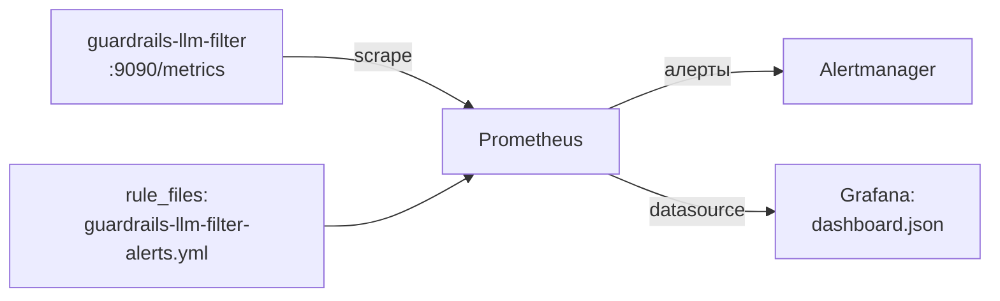

# Мониторинг: Prometheus + Grafana

Пошаговое подключение внешнего мониторинга к `guardrails-llm-filter`.
Справочник всех метрик и алертов — в [docs/operations](../operations/README.md);
живые счётчики без внешнего стека — на странице **Мониторинг** веб-консоли (`:9080`).

Собираемый стек (шаги 1–3 ниже):



## Что отдаёт сервис

| Что | Где |
|---|---|
| Метрики Prometheus | `http://<host>:9090/metrics` (порт — `GUARDRAILS_METRICS_PORT`) |
| Namespace метрик | `extproc_guardrails_` |
| JSON-сводка для консоли | `GET :9080/v1/metrics/summary` |

### Multi-replica: откуда сводка берёт счётчики

Прометеевские счётчики живут в памяти процесса, поэтому на нескольких репликах
`GET /v1/metrics/summary` без дополнительной настройки показывает только ту
реплику, которая обработала запрос, — а `rule_triggers_total`,
`data_type_triggers_total`, `requests_masked_total` и `passthrough_total`
задуманы как lifetime-цифры по всему деплойменту.

`GUARDRAILS_METRICS_SUMMARY_SOURCE` управляет источником этих четырёх семейств:

| Значение | Поведение |
|---|---|
| `auto` (по умолчанию) | общий стор при `GUARDRAILS_STORE_BACKEND=redis\|postgres`, иначе локальный gatherer |
| `store` | всегда: дельты копятся в памяти и раз в 5 с пишутся в стор одним батчем, сводка читает их оттуда |
| `local` | никогда: прежнее per-replica поведение |

Счётчики монотонны и хранятся без TTL (в Redis — хеши
`guardrails:counters:<family>`, в Postgres — таблица `guardrails_counters`).
Они не содержат PII (только mode / rule_id / data_type / вид passthrough),
поэтому не шифруются, в отличие от audit-originals.

Два ограничения, о которых стоит знать:

* **Латентные перцентили остаются per-replica.** Перцентили не складываются;
  корректная агрегация across replicas требует HDR-гистограммы, поэтому
  `latency_seconds` в сводке — про ту реплику, что ответила. Канонический
  источник по латентности в мульти-реплика деплойменте — Prometheus
  (`sum(rate(...))` по `/metrics`), как и раньше.
* **До 5 секунд задержки и потеря при падении процесса.** Дельты пишутся
  периодически; при `SIGKILL` незаписанное теряется (при штатном останове
  буфер сбрасывается). Это осознанный компромисс: счётчики — телеметрия и не
  должны добавлять ни одного round-trip на путь запроса.

Аудит-таблица для этой цифры не подходит: окно аудита ротируется по TTL, число
в нём не монотонно и не совпадает с lifetime-значением метрики.

## 1. Подключить Prometheus

Добавьте job в `prometheus.yml`:

```yaml
scrape_configs:
  - job_name: guardrails-llm-filter
    scrape_interval: 15s
    static_configs:
      # GUARDRAILS_METRICS_PORT, по умолчанию 9090
      - targets: ['guardrails-llm-filter:9090']
```

Проверка: `curl -s http://<host>:9090/metrics | grep extproc_guardrails_` должен
вернуть счётчики; в Prometheus UI → Status → Targets job должен быть `UP`.

### Kubernetes

Вариант со scrape-аннотациями на поде:

```yaml
annotations:
  prometheus.io/scrape: 'true'
  prometheus.io/port: '9090'
  prometheus.io/path: /metrics
```

Для prometheus-operator в репозитории есть готовый opt-in kustomize-компонент
(`ServiceMonitor`/`PrometheusRule`): [`deploy/kubernetes/components/monitoring/`](../../deploy/kubernetes/components/monitoring/).

## 2. Подключить алерты

Готовая группа правил — fail-open маскирование, ошибки демаскирования,
недоступность скрейпа: [`deploy/prometheus/guardrails-llm-filter-alerts.yml`](../../deploy/prometheus/guardrails-llm-filter-alerts.yml).

```yaml
# prometheus.yml
rule_files:
  - guardrails-llm-filter-alerts.yml
```

Валидация: `promtool check rules deploy/prometheus/guardrails-llm-filter-alerts.yml`.
Ключевой алерт — `GuardrailsMaskingFailures`: сервис fail-open, при ошибках
маскирования запросы уходят к провайдеру **без обработки**.

## 3. Импортировать дашборд Grafana

Готовый дашборд — [`deploy/grafana/dashboard.json`](../../deploy/grafana/dashboard.json).

1. Connections → Data sources → добавьте ваш Prometheus.
2. Dashboards → New → **Import**.
3. Загрузите `deploy/grafana/dashboard.json` (или вставьте его содержимое).
4. Выберите Prometheus data source → **Import**.

Что внутри (14 панелей в четырёх группах):

- **Traffic & detections** — запросы со срабатываниями по режимам
  (enforce/detect), топ-10 правил, срабатывания по типам данных,
  число различных правил на запрос (p50/p99).
- **Latency** — длительность пайплайна (маска + демаска), p99 сканирования и
  демаскирования, объём просканированного текста.
- **Errors (fail-open events)** — ошибки маскирования/демаскирования и
  отказов стора: всё, что означает «трафик прошёл без защиты».
- **gRPC / service health** — обработанные ext_proc-стримы по кодам,
  доступность scrape-таргетов.

> Дашборд написан под namespace `extproc_guardrails_` и не требует
> дополнительных переменных — только выбранный data source.
